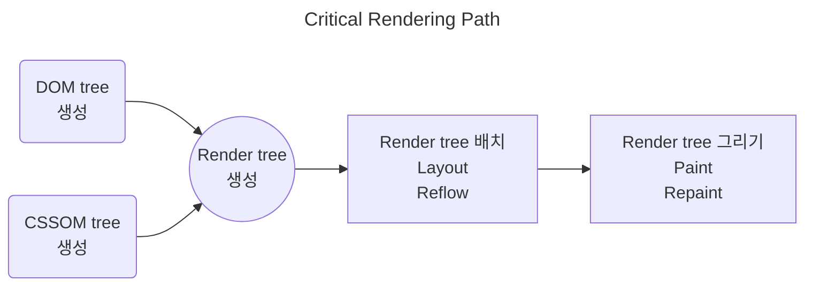

# Web Page

## DOM(Document Object Model)

- HTML 문서의 계층 및 정보를 표현하는 트리 구조
- 문서 요소를 제어할 수 있는 API, property, method 제공
- Node: DOM 을 구성하는 요소인 객체

1. 서버에서 HTML 을 동적으로 생성하는 PHP 등장
2. 브라우저에서 서버 개입 없이 HTML 의 동적 변경을 위한 JavaScript 등장

- 즉, HTML 문서를 동적으로 변경하기 위해  
  문서(document) 를 JavaScript 가 이해할 수 있는 객체(object)로 만들어  
  요소(element) 에 접근할 수 있도록 만든 인터페이스

## window 와 document

### window object

- 기본적으로 브라우저 창을 나타냄
- JavaScript 에서 최상위 객체
- HTML 요소가 아님

### document

- 웹페이지의 root 레벨 요소
- window object 의 직계 자식
- `window.document` 로 DOM 액세스

## parsing 과 rendering

### parsing

- 웹페이지의 내용을 분석하는 과정
- 브라우저는 코드에서 사용할 수 있는 구조로 document 변환

1. HTML 파싱: HTML 코드를 토큰화 한 후 토큰으로 태그를 생성하여 DOM 트리 구축
2. CSS 파싱: CSSOM 트리 구축, DOM 트리와 결합되어 render 트리 생성
3. JS 파싱: 파싱과 동시에 스크립트 실행

### rendering

- HTML, CSS, JS 리소스를 파싱하여 render 트리를 생성한 후,  
  레이아웃 계산 및 화면에 시각적으로 표현하는 과정
- 렌더링 엔진: chrome 과 safari 는 webkit, firefox 는 gecko
- 브라우저 렌더링 과정:

- Layout: 각각의 노드가 화면의 어디에 위치하는지 계산하는 단계
- Paint: 렌더트리를 픽셀로 변환하여 화면에 물리적으로 그리는 단계
